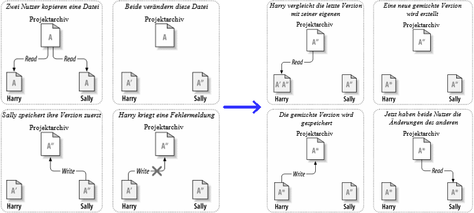

<!-- $theme: default -->
<!-- template: invert -->
<!-- $size: 16:9 -->
#
#
#
# `Versionsverwaltung mit Subversion`

### *vom Verzeichnis zum Repository*

#
#
#
#### [Christian Dähn](https://github.com/3dh-de/) 
###### Dipl.Inf. (FH)

#

###### Februar 2018, Version 0.2

---
<!-- page_number: true -->
<!-- footer: https://github.com/3dh-de/ -->

# Agenda

- Motivation
- Grundlagen
- Arbeiten im Team
- Erweiterte Bedienung
- Literatur, Quellen, weitere Infos

#
#
> Alle Beispiele und Übungen lassen sich in der kostenlosen deutschen Online-Ausgabe 
des Buches [Versions-Kontrolle mit Subversion](http://svnbook.red-bean.com/) nachvollziehen.
#

---

# Motivation

  - Source-Organisation ohne VCS
  - Alltagsprobleme ohne VCS

#
#
#

#
#
#
#
#

---

# Motivation : Source-Organisation ohne VCS

### Prinzip: Organisation in (Versions-)Verzeichnisse

* MyApp
  - 1.0.0
    - myapp.cpp
  - 1.1.0
    - myapp.cpp
    - setup.exe
    - setup.exe_new
  - 2.0.0
    ...
  - old
    ...
    
---

# Motivation : Source-Organisation ohne VCS

### Problem: Gemeinsamer Dateizugriff

###### :warning: Manuelle Abstimmung + viel Kommunikation notwendig!
#

---

# Motivation : Source-Organisation ohne VCS

### Workaround: Dateien sperren-ändern-freigeben

###### :thumbsdown: Keine parallele Bearbeitung, falsche Sicherheit...

---

# Motivation : Source-Organisation ohne VCS

### Lösung: Dateien kopieren-ändern-zusammenführen

###### :warning: Funktioniert nicht bei binären Dateien!

---

# Motivation : Alltagsprobleme ohne VCS

### Urlaub / Krankheit
   *--> Code nicht verfügbar*
   *--> Änderungen nicht für andere nachvollziehbar (Bug schon gefixed?)*
### Störungen / Mc Murphy
   *--> Datenverlust (Rechner defekt / abhanden gekommen, versehtnl. Löschung)*
   *--> Quelltextstände versehentlich überschrieben*
#
#
#
#
   
---

# Grundlagen

  - Was sind VCS?
  - Aufbau+Arbeitsweise von Subversion
  - Clients
    - Apache Subversion
    - WebSVN
    - TortoiseSVN
  - Übung

#
#
#
#

---

# Grundlagen : VCS

##### Prinzip: Kopieren-ändern-Zusammenführen
  *--> Nutzer arbeiten nur auf Kopien der Dateien*
##### Zentrale Datenhaltung auf Server = `Repository`
##### Integrierte Änderungsverfolgung
##### Integrierte Rechte- und Zugriffssteuerung

#
#
#
#
#

---

# Grundlagen : Aufbau+Arbeitsweise von Subversion

##### Speicherung & Übertragung von Unterschieden, statt Dateien
--> Speicherung & Übertragung von Änderungen stets inkrementell
##### Repositories - physisch getrennte versionierte Verzeichnisse
--> globale Revisionen, inkrementiert bei jeder Änderung

---

# Grundlagen : Aufbau+Arbeitsweise von Subversion

##### lokale "Arbeitskopien"
  *--> Commits = Änderungen hochladen ändert keine lokalen Dateien!*
  *--> Änderungen auf lokalen Daten müssen explizit angewiesen werden*
##### Konflikt-Erkennung und -Behandlung
  *--> zeilenweise Vergleiche, Vorschläge für Konfliktbehandlung*
##### flache Kopien / copy-on-write
  *--> "copy" Befehl erzeugt Verweise, echte Kopien erst bei Änderungen*

#
#
#

---

# Grundlagen : Aufbau+Arbeitsweise von Subversion

##### Ordnerstruktur

`/[SERVICE|PRODUKT]/[VARIANTE|PROJEKT]/[trunk|branches|tags]/`

z.B.:

`/SERiD/Bayern/trunk/main.cpp`  <-- Hauptentwicklungszweig = `trunk`
`/SERiD/Bayern/trunk/doc/index.html`
`/SERiD/Bayern/trunk/tests/TestMain.cpp`

`/SERiD/Bayern/tags/Release 2.0/main.cpp` <-- Kopie vom `trunk` = `tag`

`/SERiD/Bayern/branches/GUI-Redesign-1/main.cpp`  <-- Arbeitskopie = `branch` 

#
#

---

# Grundlagen : Clients

#### Gemeinsamkeiten
- Clone, Add, Commit, Update, Status ... 
- Vergleiche, Änderungen verfolgen, Konflikte auflösen
#### Apache SVN (Command line)
#### Tortoise SVN (Windows)
- Explorer-Integration, eigene Diff- und Editor-Tools

#
###### Übung: `FirstRepo` auschecken und Datei hinzufügen mit `Tortoise -> Checkout`
# [http://kobudo.3dh.de/svn/FirstRepo](http://kobudo.3dh.de/svn/FirstRepo)

---

# Arbeiten im Team

  - Branching, Merging
    - Übung: `branches` für Arbeitskopien
  - Bearbeiten einer Datei im Team
    - Übung: `mergen` paralleler Änderungen einer Datei

#
#
#
#
#
#
#
---

# Erweiterte Bedienung

  - Fehlersuche, Recherche
    - Übung: `Show log`, `Blame` und `Diff`
  - Änderungen Wiederherstellen
    - Übung: `Revert` und `Update to revision X`
  - Releases verwalten
    - Übung: `tags`

#
#
#
#
#

---

# Literatur, weitere Infos

### SVN Book ([kostenlos, HTML, deutsch](http://svnbook.red-bean.com/))

### TortoiseSVN ([Doku als HTML](https://tortoisesvn.net/docs/release/TortoiseSVN_de/tsvn-basics.html), [Download](https://www.google.de/url?sa=t&rct=j&q=&esrc=s&source=web&cd=1&cad=rja&uact=8&ved=0ahUKEwiO9Mvj7cnZAhWBLFAKHRe4AccQFggnMAA&url=https%3A%2F%2Ftortoisesvn.net%2Findex.de.html&usg=AOvVaw1ZPY4Wivi3Rsr5ILhu02Xd))

#
#

### Lizenz/Verwendung

**Bilder/Illustrationen** stammen aus dem Online-Buch [Versions-Kontrolle mit Subversion](http://svnbook.red-bean.com/) von Ben Collins-Sussman, Brian W. Fitzpatrick & C. Michael Pilato.

Diese Präsentation wurde in der Freizeit für die freie Verwendung und Verbreitung
erstellt und steht unter der MIT Lizenz = Copy-left. D.h. solange der Autor (C. Dähn) 
genannt wird, kann das Dokument (aber ggf. nicht die extern bezogenen Bilder) ohne Einschränkungen verwendet werden.
